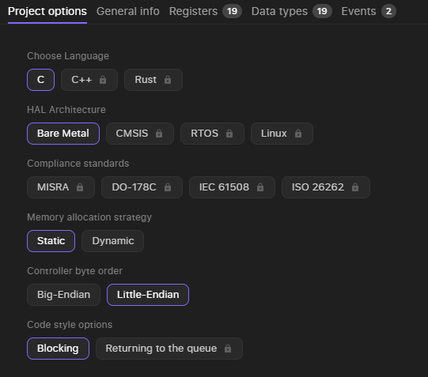
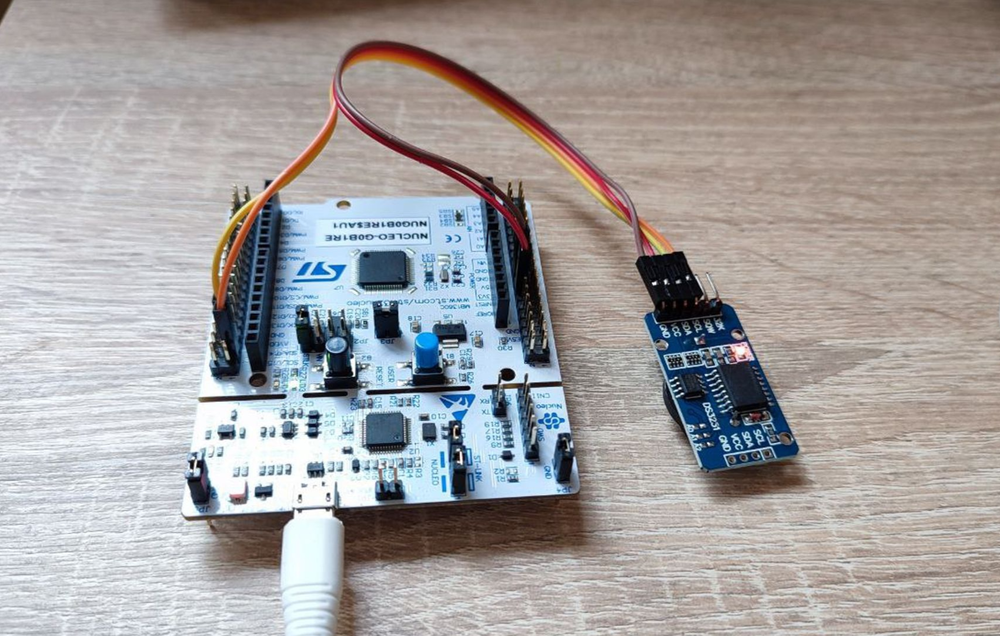

# Project Example - DS3231/VSCode

## Intro

Time is critical in embedded systems. This guide empowers you to integrate the accurate DS3231 Real-Time Clock (RTC) module effortlessly.

**What’s inside this guide:**

- **Streamlined Driver Creation:** Using Embedd to generate a custom DS3231 driver with just a few clicks.
- **Simple Integration:** Incorporate the driver into a flexible VSCode project with CMake.
- **Hands-On Validation:** Build a working example on the NUCLEO-G0B1RE development board.

### **What You'll Need**

- Hardware
    - [NUCLEO-G0B1RE](https://www.st.com/en/evaluation-tools/nucleo-g0b1re.html) -  This will be the foundation for your project, providing the microcontroller and necessary connections
    - [DS3231](https://www.analog.com/media/en/technical-documentation/data-sheets/ds3231.pdf) - Ensure it's compatible with 3.3V logic and I2C communication.
- Software
    - [Embedd Platform](https://platform.embedd.it) - AI-enabled driver generation tool
    - [STM32CubeMX](https://www.st.com/en/development-tools/stm32cubemx.html) -  A graphical tool for configuring your STM32 microcontroller.
    - [Visual Studio Code](https://code.visualstudio.com/) -  A versatile code editor.
    - [STM32 Extension](https://marketplace.visualstudio.com/items?itemName=stmicroelectronics.stm32-vscode-extension) - Adds STM32-specific features to VSCode.
    - [CMake](https://cmake.org/) - A build system simplifying the compilation process.

## Generate Your driver

We'll begin by utilising the Embedd driver generation capabilities to create a tailored driver for the DS3231 RTC IC.

Quick Video Overview: 

[Embedd_platform_recording.mp4](resources/Embedd_platform_recording.mp4)

1. **Access the Embedd Platform:**  Go to our driver generation platform at [https://platform.embedd.it/](https://platform.embedd.it/).
2. **Upload the Datasheet:** Upload your DS3231 datasheet (in PDF format) to the platform. Our system will automatically extract the essential parameters and specifications.
3. **Configure Your Driver:**
    - Select "DS3231" from the component list
    - A configuration panel will appear. Here's where you can customize the driver to your exact requirements. Take a look at the screenshot below for a recommended starting point:
        
        
        
4. **Download Your Driver:** Once you've finalized your configurations, simply click the "Generate Driver" button. Your custom DS3231 driver will be available for download:
    
    
    

## Generate a project using STM32CubeMX( for CMake )

While a full tutorial on STM32CubeMX is beyond the scope of this guide, we'll focus on a crucial step for seamless integration with the DS3231 chip.

1. **Create Your Project:** Open STM32CubeMX and create a new project for your NUCLEO-G0B1RE board.
2. **Pinout Configuration:**
    - In the "Pinout & Configuration" tab, locate the "System Core" section.
    - Expand the "I2C1" peripheral. Notice that by default, the SDA and SCL pins are assigned to PA10 and PA9, respectively.
    - To use the more convenient Arduino header pins, we need to remap I2C1:
        
        
        
        - Click on the "PB9" (SDA) pin and select "I2C1_SDA" from the dropdown menu.
        - Click on the "PB8" (SCL) pin and select "I2C1_SCL" from the dropdown menu
3. **Toolchain/IDE:**
    - In the “Project Manager” tab locate the “Toolchain/IDE” option and choose the “CMake” from the dropdown menu.
4. **Generate Code:** Click "Generate Code" to create your CMake project with the necessary initialization and configuration.

## Add the driver to the build system

1. **Locate Your Project:** Open your newly generated CMake project. You'll see a basic project structure similar to this:
    
    
    
2. **Organize Your Driver Files:** To keep things organized, create a new folder named `ds3231` within `Drivers` directory.
3. **Extract and Copy:** Unzip the downloaded DS3231 driver archive (`.zip`) into the `Drivers/ds3231` folder. Your updated project structure will now include the driver files:
    
    
    
4. **Update CMakeLists.txt:** To enable CMake to locate and compile your driver files, you'll need to update the `CMakeLists.txt` file. Open it in the root of your project and locate the following sections:
    - **`target_sources()`:** This section lists the source files to be compiled. Under the comment `# Add user sources here`, add the paths to all the `.c` files within the `Drivers/ds3231` directory.
    - **`target_include_directories()`:** This section specifies the directories where the compiler should search for header files (`.h`). Under the comment `# Add user defined include paths`, add the path `Drivers/ds3231`.
    
    After adding the necessary paths, your `CMakeLists.txt` should look like this:
    
    ```makefile
    # Add sources to executable
    target_sources(${CMAKE_PROJECT_NAME} PRIVATE
        # Add user sources here
        Drivers/ds3231/ds3231_registers.c
        Drivers/ds3231/ds3231.c
        Drivers/ds3231/embedd_event.c
        Drivers/ds3231/embedd_hal.c
        Drivers/ds3231/embedd_i2c.c
        Drivers/ds3231/embedd_misc.c
        Drivers/ds3231/event_manager.c
    )
    
    # Add include paths
    target_include_directories(${CMAKE_PROJECT_NAME} PRIVATE
        # Add user defined include paths
        Drivers/ds3231
    )
    ```
    
5. **Include the Header:** To use the driver's functions in your project, you need to include the main header file in your `main.c` file. In the `/* USER CODE BEGIN Includes */` section of your `main.c` file, add the following line:
    
    ```c
    #include "ds3231.h"
    ```
    

**Please note:**

- **User Code Sections:** Using the `/* USER CODE BEGIN */` and `/* USER CODE END */` markers is crucial. These sections are preserved when you regenerate project files with STM32CubeMX, ensuring your custom code isn't overwritten.

## Preparing the device object

With the driver integrated into your project, it's time to create the objects that facilitate communication with your DS3231 RTC module. This section will guide you through creating the device object, defining the necessary bus functions, and implementing the bus object to bridge your code with the hardware.

1. **Create the Device Object:** In your `main.c` file, locate the `/* USER CODE BEGIN PM */` and  `/* USER CODE END PM */` section. Within this section, add the following line to instantiate a DS3231 device object:
    
    ```c
    DS3231_I2C_DEVICE_DEFINE(clock_chip, "DS3231")
    ```
    
    This macro does the following:
    
    - Creates a `clock_chip` object to represent your DS3231 RTC module.
    - Initializes the internal data structures required for interaction with the device.
2. **Declare Bus Functions:** In the `/* USER CODE BEGIN PFP */` and `/* USER CODE END PFP */` section of `main.c`, declare the function prototypes for handling I2C communication:
    
    ```c
    static EMBEDD_RESULT ds3231_bus_write(const struct embedd_device_t* dev, const uint8_t* data_ptr, uint32_t data_size);
    static EMBEDD_RESULT ds3231_bus_read(const struct embedd_device_t* dev, uint8_t* data_ptr, uint32_t data_size);
    ```
    
    These functions will handle the actual reading and writing of data over the I2C bus.
    
3. **Create the Bus Object:** Within the `/* USER CODE BEGIN 0 */` and `/* USER CODE END 0 */` section of your `main.c` file, create the `ds3231_bus` object and initialize it with the declared bus functions:
    
    ```c
    static embedd_bus_t ds3231_bus = {
        .write = ds3231_bus_write,
        .read = ds3231_bus_read
    };
    ```
    
    This `ds3231_bus` object encapsulates the read and write functions, providing a unified interface for communication with the DS3231.
    
4. **Implement Bus Functions:** The Embedd driver needs to know how to communicate with the I2C peripheral on your microcontroller. In the `/* USER CODE BEGIN 4 */` and `/* USER CODE END 4 */` section, implement the following functions using the STM32 HAL library:
    - **`ds3231_bus_write`:** This function is responsible for writing data to the DS3231 over the I2C bus.
        
        ```c
        EMBEDD_RESULT ds3231_bus_write(const struct embedd_device_t* dev, const uint8_t* data_ptr, uint32_t data_size)
        {
          if( ( dev == NULL ) || ( data_ptr == NULL ) )
          {
            return EMBEDD_RESULT_ERR;
          }
        
          //Extracting I2C configurations from the device object
          embedd_i2c_dev_cfg_t* dev_cfg = embedd_i2c_get_dev_config( dev );
          if( dev_cfg == NULL )
          {
              return EMBEDD_RESULT_ERR;
          }
        
          //Writing data to the bus
          HAL_StatusTypeDef status = HAL_I2C_Master_Transmit(&hi2c1, (dev_cfg->addr << 1), (uint8_t*)data_ptr, data_size, 100);
          if( status != HAL_OK)
          {
              return EMBEDD_RESULT_ERR;
          }
        
          return EMBEDD_RESULT_OK;
        }
        ```
        
    - **`ds3231_bus_read`:** This function reads data from the DS3231 over the I2C bus.
        
        ```c
        EMBEDD_RESULT ds3231_bus_read(const struct embedd_device_t* dev, uint8_t* data_ptr, uint32_t data_size)
        {
          if( ( dev == NULL ) || ( data_ptr == NULL ) )
          {
              return EMBEDD_RESULT_ERR;
          }
        
          //Extracting I2C configurations from the device object
          embedd_i2c_dev_cfg_t* dev_cfg = embedd_i2c_get_dev_config( dev );
          if( dev_cfg == NULL ){
              return EMBEDD_RESULT_ERR;
          }
        
          //Reading data from the bus
          HAL_StatusTypeDef status = HAL_I2C_Master_Receive(&hi2c1, (dev_cfg->addr << 1), data_ptr, data_size, 100);
          if( status != HAL_OK)
          {
              return EMBEDD_RESULT_ERR;
          }
        
          return EMBEDD_RESULT_OK;
        }
        ```
        
    
    **Key Point:** In the provided code snippets for `ds3231_bus_write` and `ds3231_bus_read`, make sure to left shift the device address by 1 to form 7-bit address.
    
5. **Implement the Delay Function:** Finally, implement the `embedd_hal_sleep` function declared within `Drivers/ds3231/embedd_hal.h` file to provide a delay mechanism. This function is used within the driver for timing-sensitive operations. You can use the `HAL_Delay` function and implement it within the `/* USER CODE BEGIN 4 */` and `/* USER CODE END 4 */` as well.
    
    ```c
    void embedd_hal_sleep( uint32_t mseconds )
    {
        HAL_Delay(mseconds);
    }
    ```
    

By completing these steps, you have created and prepared the necessary objects for establishing communication between your code and the DS3231 RTC module through the I2C bus.

## Device’s initialization

With the device and bus objects in place, let's initialize the DS3231 RTC module to establish communication and prepare it for accurate timekeeping.

1. **Define the I2C Address:** The DS3231 RTC module communicates over the I2C bus and requires a specific address for identification. The default address for most DS3231 modules is `0x68`. Add this definition within the `/* USER CODE BEGIN PD */` and `/* USER CODE END PD */` section of your `main.c` file:
    
    ```c
    #define DS3231_I2C_DEV_ADDR 0x68
    ```
    
2. Inside the `/* USER CODE BEGIN 2 */` and `/* USER CODE END 2 */` section, perform the following initialization steps:
    
    ```c
    /* Assign the I2C bus object to the device object */
      clock_chip.bus = &ds3231_bus;
    
      /* Configure the I2C device settings for the DS3231 */
      embedd_i2c_dev_cfg_t clock_chip_cfg = {.addr = DS3231_I2C_DEV_ADDR};
      embedd_i2c_set_dev_config(&clock_chip, &clock_chip_cfg);clock_chip.bus = &ds3231_bus;
    ```
    
    **Explanation:**
    
    - **I2C Address:** This unique address allows the microcontroller to communicate specifically with your DS3231 module over the I2C bus.
    - **Bus Assignment:** The line `clock_chip.bus = &ds3231_bus;` connects the DS3231 device object (`clock_chip`) to the I2C bus object (`ds3231_bus`) you created earlier. This connection enables the device to utilize the read and write functions defined in your bus object for I2C communication.
    - **Device Configuration:** The `embedd_i2c_set_dev_config` function takes the `clock_chip` device object and the configuration structure (`clock_chip_cfg`) as arguments. It sets the I2C address of the DS3231 module within the device object, ensuring proper communication on the bus.

## Verify Your Driver's Operation

Let's write a simple test code to confirm that your INA219 driver is working correctly.

1. **Read Registers (Test Loop)**: In the `/* USER CODE BEGIN WHILE */` and `/* USER CODE END WHILE */` section of your `main.c` file's `while(1)` loop, add the following code:
    
    ```c
    uint8_t seconds_reg         = 0;
    uint8_t minutes_reg         = 0;
    uint8_t hour_reg            = 0;
    uint8_t day_reg             = 0;
    uint8_t date_reg            = 0;
    uint8_t monthcentury_reg    = 0;
    uint8_t year_reg            = 0;
    uint8_t alarm_1_seconds_reg = 0;
    uint8_t alarm_1_minutes_reg = 0;
    uint8_t alarm_1_hour_reg    = 0;
    uint8_t alarm_1_daydate_reg = 0;
    uint8_t alarm_2_minutes_reg = 0;
    uint8_t alarm_2_hour_reg    = 0;
    uint8_t alarm_2_daydate_reg = 0;
    uint8_t control_reg         = 0;
    uint8_t status_reg          = 0;
    uint8_t aging_offset_reg    = 0;
    uint8_t msb_of_temp_reg     = 0;
    uint8_t lsb_of_temp_reg     = 0;
    
    // Read all registers
    if (DS3231_READ_REG( clock_chip, ds3231_seconds,         seconds_reg )         == EMBEDD_RESULT_OK &&
        DS3231_READ_REG( clock_chip, ds3231_minutes,         minutes_reg )         == EMBEDD_RESULT_OK &&
        DS3231_READ_REG( clock_chip, ds3231_hour,            hour_reg )            == EMBEDD_RESULT_OK &&
        DS3231_READ_REG( clock_chip, ds3231_day,             day_reg )             == EMBEDD_RESULT_OK &&
        DS3231_READ_REG( clock_chip, ds3231_date,            date_reg )            == EMBEDD_RESULT_OK &&
        DS3231_READ_REG( clock_chip, ds3231_monthcentury,    monthcentury_reg )    == EMBEDD_RESULT_OK &&
        DS3231_READ_REG( clock_chip, ds3231_year,            year_reg )            == EMBEDD_RESULT_OK &&
        DS3231_READ_REG( clock_chip, ds3231_alarm_1_seconds, alarm_1_seconds_reg ) == EMBEDD_RESULT_OK &&
        DS3231_READ_REG( clock_chip, ds3231_alarm_1_minutes, alarm_1_minutes_reg ) == EMBEDD_RESULT_OK &&
        DS3231_READ_REG( clock_chip, ds3231_alarm_1_hour,    alarm_1_hour_reg )    == EMBEDD_RESULT_OK &&
        DS3231_READ_REG( clock_chip, ds3231_alarm_1_daydate, alarm_1_daydate_reg ) == EMBEDD_RESULT_OK &&
        DS3231_READ_REG( clock_chip, ds3231_alarm_2_minutes, alarm_2_minutes_reg ) == EMBEDD_RESULT_OK &&
        DS3231_READ_REG( clock_chip, ds3231_alarm_2_hour,    alarm_2_hour_reg )    == EMBEDD_RESULT_OK &&
        DS3231_READ_REG( clock_chip, ds3231_alarm_2_daydate, alarm_2_daydate_reg ) == EMBEDD_RESULT_OK &&
        DS3231_READ_REG( clock_chip, ds3231_control,         control_reg )         == EMBEDD_RESULT_OK &&
        DS3231_READ_REG( clock_chip, ds3231_status,          status_reg )          == EMBEDD_RESULT_OK &&
        DS3231_READ_REG( clock_chip, ds3231_aging_offset,    aging_offset_reg )    == EMBEDD_RESULT_OK &&
        DS3231_READ_REG( clock_chip, ds3231_msb_of_temp,     msb_of_temp_reg )     == EMBEDD_RESULT_OK &&
        DS3231_READ_REG( clock_chip, ds3231_lsb_of_temp,     lsb_of_temp_reg )     == EMBEDD_RESULT_OK)
    {
        /* USER CODE BEGIN IN CASE OF SUCCESS */
        debug("Register map:\r\n");
        debug("  SECONDS           - 0x%02X\r\n", seconds_reg);
        debug("  MINUTES           - 0x%02X\r\n", minutes_reg);
        debug("  HOUR              - 0x%02X\r\n", hour_reg);
        debug("  DAY               - 0x%02X\r\n", day_reg);
        debug("  DATE              - 0x%02X\r\n", date_reg);
        debug("  MONTH_CENTURY     - 0x%02X\r\n", monthcentury_reg);
        debug("  YEAR              - 0x%02X\r\n", year_reg);
        debug("  ALARM_1_SECONDS   - 0x%02X\r\n", alarm_1_seconds_reg);
        debug("  ALARM_1_MINUTES   - 0x%02X\r\n", alarm_1_minutes_reg);
        debug("  ALARM_1_HOUR      - 0x%02X\r\n", alarm_1_hour_reg);
        debug("  ALARM_2_MINUTES   - 0x%02X\r\n", alarm_2_minutes_reg);
        debug("  ALARM_2_HOUR      - 0x%02X\r\n", alarm_2_hour_reg);
        debug("  ALARM_2_DAY_DATE  - 0x%02X\r\n", alarm_2_daydate_reg);
        debug("  CONTROL           - 0x%02X\r\n", control_reg);
        debug("  STATUS            - 0x%02X\r\n", status_reg);
        debug("  AGING_OFFSET      - 0x%02X\r\n", aging_offset_reg);
        debug("  TEMPERATURE_MSB   - 0x%02X\r\n", msb_of_temp_reg);
        debug("  TEMPERATURE_LSB   - 0x%02X\r\n", lsb_of_temp_reg);
        /* USER CODE END IN CASE OF SUCCESS */
    }
    else
    {
        /* USER CODE BEGIN IN CASE OF ERROR */
        debug("Registers reading error!\r\n");
        /* USER CODE END IN CASE OF ERROR */
    }
    HAL_Delay(5000); // Wait 5 seconds before reading again
    ```
    
    **Explanation:**
    
    1. **Variables:** The code declares variables to hold the values read from each DS3231 register.
    2. **Register Reads:** It uses the `DS3231_READ_REG` macro (provided by the Embedd driver) to read each register.
    3. **Success/Error Handling:**
        - If all reads are successful (return `EMBEDD_RESULT_OK`), you can access the register values in the `config_reg`, `shunt_voltage_reg`, etc. variables.
        - If any read fails, the `else` block is executed.
2. **Debug Output (UART):** This function allows us to see the registers content or an error during the test loop. This function uses the UART2 which is initialized by default(115200, N, 1) by STM32CubeMX and available via STLink micro USB connector. It requires:
    - Place additional includes within `/* USER CODE BEGIN Includes */` and `/* USER CODE END Includes */`  section
    
    ```c
    #include <stdio.h>
    #include <stdarg.h>
    ```
    
    - Place a buffer within `/* USER CODE BEGIN PV */` and `/* USER CODE END PV */`  section
        
        ```c
        uint8_t debug_buf[100];
        ```
        
    - Define the function in the `/* USER CODE BEGIN PFP */` and `/* USER CODE END PFP */`  section
        
        ```c
        static void debug(const char *format, ...) __attribute__ ((format (printf, 1, 2)));
        ```
        
    - Implement the function in the `/* USER CODE BEGIN 4 */` and `/* USER CODE END 4 */` section
        
        ```c
        void debug(const char *format, ...)
        {
            va_list args;
        
            va_start(args, format);
            uint16_t debug_msg_size = vsnprintf((char *)debug_buf, sizeof debug_buf, format, args);
            va_end(args);
        
            HAL_UART_Transmit(&huart2, debug_buf, debug_msg_size, 100);
        }
        ```
        
3. **Build and Run:** 
    - **Build Project:** In VSCode, click `Build` button or right click on `CMakeList.txt` and choose `Build All Projects` from dropped down many to compile your code.
        - The issue you might face with on this stage is:
            
            ```c
            [build] <compiler_location>/arm-none-eabi/12.3.1/../../../../arm-none-eabi/bin/ld.exe: CMakeFiles/DS3231-VSCode.dir/Drivers/ds3231/embedd_i2c.c.obj: in function `embedd_i2c_set_dev_config':
            [build] <project_location>/Drivers/ds3231/embedd_i2c.c:34: undefined reference to `embedd_i2c_is_sub_addr_valid'
            ```
            
        - This issue appears when a compiler do not put the function `embedd_i2c_set_dev_config` inline right into the code and gets several functions with the same name.
        - To solve this issue you need to simply add the `static` keyword to make this function local for each file including `embedd_i2c.h` file. Thus, the full function definition should look like: `static inline bool embedd_i2c_is_sub_addr_valid(uint16_t addr)`
    - **Flash to Board:** Connect your NUCLEO-G0B1RE to your computer and flash the compiled code onto it. Here is how our HW setup looks like:
        
        
        
    - **Observe Output:** Monitor the console output to see the register values from the DS3231 RTC board. We got the following output:
        
        ```powershell
        Register map:
          SECONDS           - 0x53
          MINUTES           - 0x59
          HOUR              - 0x00
          DAY               - 0x01
          DATE              - 0x01
          MONTH_CENTURY     - 0x01
          YEAR              - 0x00
          ALARM_1_SECONDS   - 0x00
          ALARM_1_MINUTES   - 0x00
          ALARM_1_HOUR      - 0x00
          ALARM_2_MINUTES   - 0x00
          ALARM_2_HOUR      - 0x00
          ALARM_2_DAY_DATE  - 0x00
          CONTROL           - 0x1C
          STATUS            - 0x88
          AGING_OFFSET      - 0x00
          TEMPERATURE_MSB   - 0x18
          TEMPERATURE_LSB   - 0x00
        Register map:
          SECONDS           - 0x58
          MINUTES           - 0x59
          HOUR              - 0x00
          DAY               - 0x01
          DATE              - 0x01
          MONTH_CENTURY     - 0x01
          YEAR              - 0x00
          ALARM_1_SECONDS   - 0x00
          ALARM_1_MINUTES   - 0x00
          ALARM_1_HOUR      - 0x00
          ALARM_2_MINUTES   - 0x00
          ALARM_2_HOUR      - 0x00
          ALARM_2_DAY_DATE  - 0x00
          CONTROL           - 0x1C
          STATUS            - 0x88
          AGING_OFFSET      - 0x00
          TEMPERATURE_MSB   - 0x18
          TEMPERATURE_LSB   - 0x00
        Register map:
          SECONDS           - 0x03
          MINUTES           - 0x00
          HOUR              - 0x01
          DAY               - 0x01
          DATE              - 0x01
          MONTH_CENTURY     - 0x01
          YEAR              - 0x00
          ALARM_1_SECONDS   - 0x00
          ALARM_1_MINUTES   - 0x00
          ALARM_1_HOUR      - 0x00
          ALARM_2_MINUTES   - 0x00
          ALARM_2_HOUR      - 0x00
          ALARM_2_DAY_DATE  - 0x00
          CONTROL           - 0x1C
          STATUS            - 0x88
          AGING_OFFSET      - 0x00
          TEMPERATURE_MSB   - 0x18
          TEMPERATURE_LSB   - 0x00
        ```
        
        Here you can see that `SECONDS`  register increases by 5 which is the delay we added within the code. And when the `SECONDS`  value overflows  the maximum seconds value(60 seconds) the `MINUTES` and `HOURS` registers registers are updated as expected.
        
4. **Reset the clock**: Let's take your driver for a spin! We'll reset the DS3231's timekeeping registers to demonstrate how to use the `DS3231_WRITE_REG` macro and confirm that the driver is writing data correctly.
    - Write the following code inside the `/* USER CODE BEGIN 2 */` and `/* USER CODE END 2 */` section after the device’s object initialization:
        
        ```c
        /* Clear the time keeping registers */
        uint8_t reg_value = 0;
        if (DS3231_WRITE_REG( clock_chip, ds3231_seconds,      reg_value ) == EMBEDD_RESULT_OK &&
            DS3231_WRITE_REG( clock_chip, ds3231_minutes,      reg_value ) == EMBEDD_RESULT_OK &&
            DS3231_WRITE_REG( clock_chip, ds3231_hour,         reg_value ) == EMBEDD_RESULT_OK &&
            DS3231_WRITE_REG( clock_chip, ds3231_day,          reg_value ) == EMBEDD_RESULT_OK &&
            DS3231_WRITE_REG( clock_chip, ds3231_date,         reg_value ) == EMBEDD_RESULT_OK &&
            DS3231_WRITE_REG( clock_chip, ds3231_monthcentury, reg_value ) == EMBEDD_RESULT_OK &&
            DS3231_WRITE_REG( clock_chip, ds3231_year,         reg_value ) == EMBEDD_RESULT_OK)
        {
            debug("Clock has been successfully reset\r\n");
        }
        ```
        
    - Rebuild your project in VSCode using the build button or by right-clicking on `CMakeLists.txt` and choosing "Build All Projects".
    - Monitor your console output. You should see the following:
        
        ```c
        Clock has been successfully reset
        Register map:
          SECONDS           - 0x00
          MINUTES           - 0x00
          HOUR              - 0x00
          DAY               - 0x00
          DATE              - 0x00
          MONTH_CENTURY     - 0x00
          YEAR              - 0x00
          ALARM_1_SECONDS   - 0x00
          ALARM_1_MINUTES   - 0x00
          ALARM_1_HOUR      - 0x00
          ALARM_2_MINUTES   - 0x00
          ALARM_2_HOUR      - 0x00
          ALARM_2_DAY_DATE  - 0x00
          CONTROL           - 0x1C
          STATUS            - 0x8B
          AGING_OFFSET      - 0x00
          TEMPERATURE_MSB   - 0x18
          TEMPERATURE_LSB   - 0x00
        Register map:
          SECONDS           - 0x05
          MINUTES           - 0x00
          HOUR              - 0x00
          DAY               - 0x00
          DATE              - 0x00
          MONTH_CENTURY     - 0x00
          YEAR              - 0x00
          ALARM_1_SECONDS   - 0x00
          ALARM_1_MINUTES   - 0x00
          ALARM_1_HOUR      - 0x00
          ALARM_2_MINUTES   - 0x00
          ALARM_2_HOUR      - 0x00
          ALARM_2_DAY_DATE  - 0x00
          CONTROL           - 0x1C
          STATUS            - 0x8B
          AGING_OFFSET      - 0x00
          TEMPERATURE_MSB   - 0x18
          TEMPERATURE_LSB   - 0x00
        ```
        
        **Interpretation:**
        
        - **Successful Reset:** The "Clock has been successfully reset" message confirms that the `DS3231_WRITE_REG` macro functioned correctly, writing zeros to the timekeeping registers.
        - **Timekeeping Resumes:** The subsequent register maps show the `SECONDS` register incrementing every 5 seconds (due to the `HAL_Delay` in your main loop), proving that the DS3231 is now keeping time from the reset point.

## Conclusion

Integrating the DS3231 RTC with Embedd and CMake showcases how you can accelerate embedded development while maintaining precision timekeeping. Your successful driver implementation and register interactions lay a strong foundation for future projects.

**Key Takeaways:**

- **Effortless Driver Creation:** Embedd significantly simplified driver generation, saving valuable development time.
- **Seamless CMake Integration:** Leveraged CMake's flexibility for project organization and build management.
- **Operational Success:** The ability to read and manipulate the DS3231's registers validated your driver's functionality.